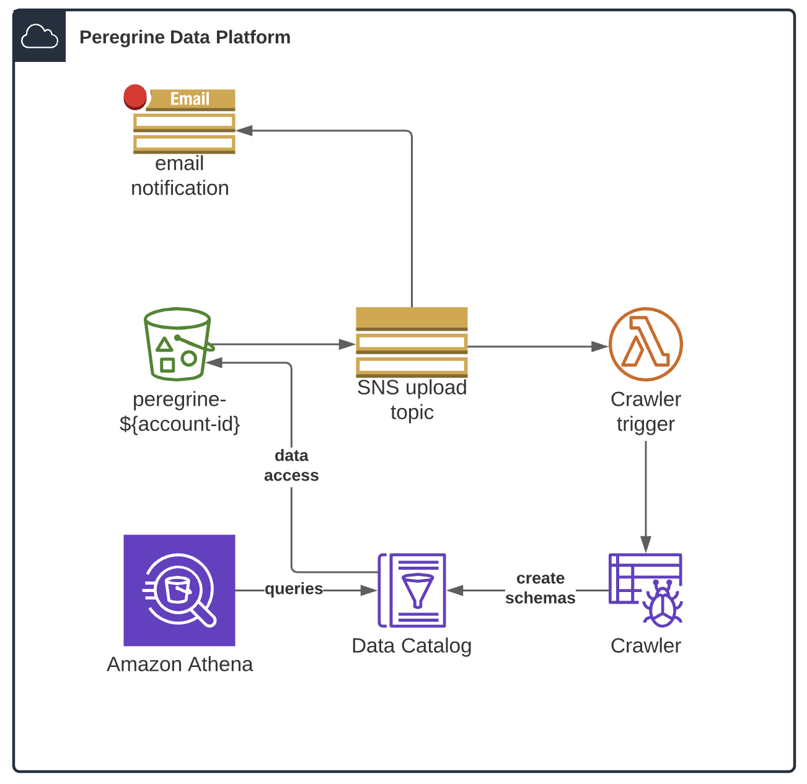

# Peregrine Data Platform
The Peregrine Data Platform is an AWS CDK application written in Java that deploys a data analytics pipeline using S3, Glue, and Athena.  As new data are uploaded to the Peregrine S3 bucket, a Glue crawler is triggered to determine the schema and make the data available for querying using Athena.  Sample JSON and CSV datasets are included.  
  
Annual AWS costs to operate the demo are approximately $20.  A configurable budget shell is available [here](https://calculator.aws/#/estimate?id=6364c2449813a696e4d02427800618a713aa6be6).  

 

## Requirements

The following requirements must be met prior to deployment:

1. [AWS CDK Prerequisites](https://docs.aws.amazon.com/cdk/latest/guide/work-with.html#work-with-prerequisites)
2. [Java Prerequisites](https://docs.aws.amazon.com/cdk/latest/guide/work-with-cdk-java.html#java-prerequisites)
3. [Git](https://git-scm.com/downloads)

## Installation
Execute the commands below to deploy the application.  Substitute a valid email address in the parameters argument for receiving data upload notifications. 

    git clone https://gitlab.westat.com/ausborn_s/peregrine
    cd peregrine
    cdk synth
    cdk deploy --parameters emailAddress=peregrine(at)westat(dot)com

## Usage
1. **Confirm SNS subscription**  
Once the deployment is complete, check the inbox of the supplied email address to confirm notifications for data upload activity.  

2. **Retrieve the Peregrine API key**  
To access the API credentials of the IAM user created by the application, which is used to connect to the S3 bucket and Athena with client software, execute the  AWS CLI command below.  If you do not have the AWS CLI installed, you may retrieve the API key from the Secrets Manager console.

        aws secretsmanager get-secret-value --secret-id peregrineKey --query SecretString --output text
    

3. **Upload files to S3**  
New data may be uploaded into the Peregrine S3 bucket via the AWS console, or by using a file transfer client such as Cyberduck (macOS) or WinSCP (Windows).  For the clients, specify S3 as the transfer protocol and use the API access key as the username and secret key as the password.  New data should be uploaded into a separate folder created alongside the existing sample datasets.  Once data are uploaded, the crawler will begin to execute automatically. 

    For best results, use delimited text files with column headings.  JSON files should contain one object per line. 

4. **Query data with Athena**  
After the crawler executes, data will be available for querying using Athena.  An Athena workgroup called "peregrine" is created to provide access to data and a query result location.  A max scan size of 1GB per query is set by the application, but this may be adjusted in the code.  
  
    To access Athena tables from a SQL client, use a JDBC driver connection and provide the following properties along with the API access key and secret key for username and password:  

    **Region**:  us-east-1  
**S3 Output Location**:  s3://aws-athena-query-results-peregrine-*accountID*  
**Workgroup**: peregrine